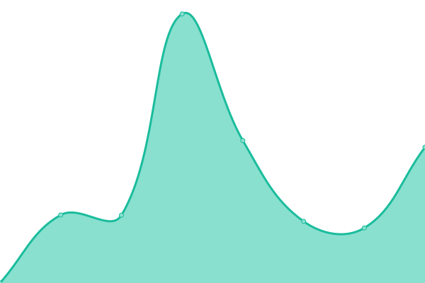
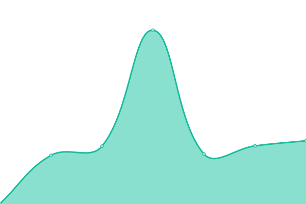

# [📈 Live Status](https://bigbeartechworld.github.io/uptime): <!--live status--> **🟩 All systems operational**

This repository contains the open-source uptime monitor and status page for [Big Bear Tech World](https://bigbeartechworld.com), powered by [Upptime](https://github.com/upptime/upptime).

With [Upptime](https://upptime.js.org), you can get your own unlimited and free uptime monitor and status page, powered entirely by a GitHub repository. We use [Issues](https://github.com/bigbeartechworld/uptime/issues) as incident reports, [Actions](https://github.com/bigbeartechworld/uptime/actions) as uptime monitors, and [Pages](https://bigbeartechworld.github.io/uptime) for the status page.

<!--start: status pages-->
<!-- This summary is generated by Upptime (https://github.com/upptime/upptime) -->
<!-- Do not edit this manually, your changes will be overwritten -->
<!-- prettier-ignore -->
| URL | Status | History | Response Time | Uptime |
| --- | ------ | ------- | ------------- | ------ |
|  [BigBearTechWorld](https://bigbeartechworld.com) | 🟩 Up | [big-bear-tech-world.yml](https://github.com/bigbeartechworld/uptime/commits/master/history/big-bear-tech-world.yml) | 

 200ms
     
 | 

<a href="https://status.bigbeartechworld.com/history/big-bear-tech-world">100.00%</a>
    

|  [BigBearTechHub](https://bigbeartechhub.com) | 🟩 Up | [big-bear-tech-hub.yml](https://github.com/bigbeartechworld/uptime/commits/master/history/big-bear-tech-hub.yml) | 

 1393ms
     
 | 

<a href="https://status.bigbeartechworld.com/history/big-bear-tech-hub">100.00%</a>
    

|  [Boxinvy](https://boxinvy.com) | 🟩 Up | [boxinvy.yml](https://github.com/bigbeartechworld/uptime/commits/master/history/boxinvy.yml) | 

 364ms
     
 | 

<a href="https://status.bigbeartechworld.com/history/boxinvy">100.00%</a>
    

|  [DoorKnockerPal](https://doorknockerpal.com) | 🟩 Up | [door-knocker-pal.yml](https://github.com/bigbeartechworld/uptime/commits/master/history/door-knocker-pal.yml) | 

 275ms
     
 | 

<a href="https://status.bigbeartechworld.com/history/door-knocker-pal">100.00%</a>
    

|  [DoorKnockerPal Dashboard](https://dashboard.doorknockerpal.com) | 🟩 Up | [door-knocker-pal-dashboard.yml](https://github.com/bigbeartechworld/uptime/commits/master/history/door-knocker-pal-dashboard.yml) | 

 210ms
     
 | 

<a href="https://status.bigbeartechworld.com/history/door-knocker-pal-dashboard">100.00%</a>
    

|  [Emailcove](https://emailcove.com) | 🟩 Up | [emailcove.yml](https://github.com/bigbeartechworld/uptime/commits/master/history/emailcove.yml) | 

 267ms
     
 | 

<a href="https://status.bigbeartechworld.com/history/emailcove">100.00%</a>
    

|  [Goalpense](https://goalpense.bigbeartechworld.com) | 🟩 Up | [goalpense.yml](https://github.com/bigbeartechworld/uptime/commits/master/history/goalpense.yml) | 

 355ms
     
 | 

<a href="https://status.bigbeartechworld.com/history/goalpense">100.00%</a>
    

|  [Mealinvy](https://mealinvy.com) | 🟩 Up | [mealinvy.yml](https://github.com/bigbeartechworld/uptime/commits/master/history/mealinvy.yml) | 

 298ms
     
 | 

<a href="https://status.bigbeartechworld.com/history/mealinvy">100.00%</a>
    

|  [Panelbay](https://panelbay.bigbeartechworld.com) | 🟩 Up | [panelbay.yml](https://github.com/bigbeartechworld/uptime/commits/master/history/panelbay.yml) | 

 244ms
     
 | 

<a href="https://status.bigbeartechworld.com/history/panelbay">100.00%</a>
    

|  [PilotCarHub](https://pilotcarhub.com) | 🟩 Up | [pilot-car-hub.yml](https://github.com/bigbeartechworld/uptime/commits/master/history/pilot-car-hub.yml) | 

 362ms
     
 | 

<a href="https://status.bigbeartechworld.com/history/pilot-car-hub">100.00%</a>
    

|  [TwistedText](https://twistedtext.bigbeartechworld.com) | 🟩 Up | [twisted-text.yml](https://github.com/bigbeartechworld/uptime/commits/master/history/twisted-text.yml) | 

 218ms
     
 | 

<a href="https://status.bigbeartechworld.com/history/twisted-text">99.42%</a>
    

|  [Wealtor](https://wealtor.com) | 🟩 Up | [wealtor.yml](https://github.com/bigbeartechworld/uptime/commits/master/history/wealtor.yml) | 

 309ms
     
 | 

<a href="https://status.bigbeartechworld.com/history/wealtor">100.00%</a>
    

<!--end: status pages-->

[**Visit our status website →**](https://bigbeartechworld.github.io/uptime)

## 📄 License

- Powered by: [Upptime](https://github.com/upptime/upptime)
- Code: [MIT](./LICENSE) © [Big Bear Tech World](https://bigbeartechworld.com)
- Data in the `./history` directory: [Open Database License](https://opendatacommons.org/licenses/odbl/1-0/)
